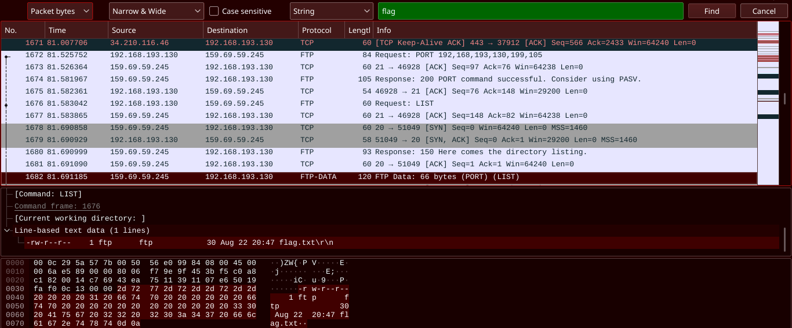
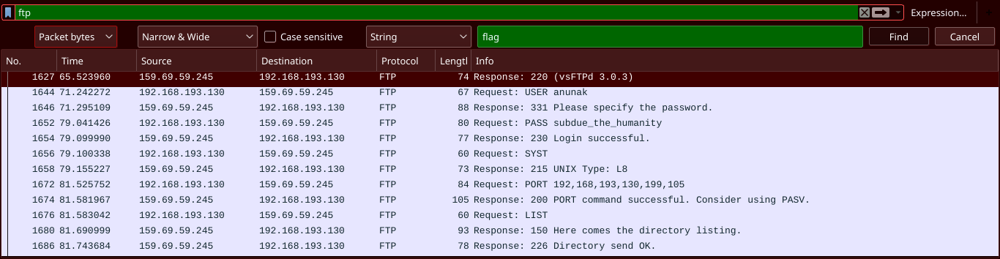

# ZIP Games (231)

> Мы перехватили какой-то странный интернет-трафик. Нам кажется, эти люди что-то замышляют. Впрочем, люди ли?

Прикрепленные файлы: _[intercepted.pcap](intercepted.pcap)_

## Решение

Для решения данного задания нам понадобится **Wireshark**

Мне было лень копаться среди кучи пакетов, поэтому можно воспользоваться поиском:

Видим, что файл _flag.txt_ запрашивался по протоколу **FTP**.

Поставим фильтр на данный протокол:

Видим, что подключение производилось к серверу с IP `159.69.59.245`, логином `anunak` и паролем `subdue_the_humanity`  
Используем любой FTP-клиент, авторизуемся, получаем флаг.

**Флаг:** `CC{1_s33_wh47_y0u_d1d_7h3r3}`

**Решили:** 264
